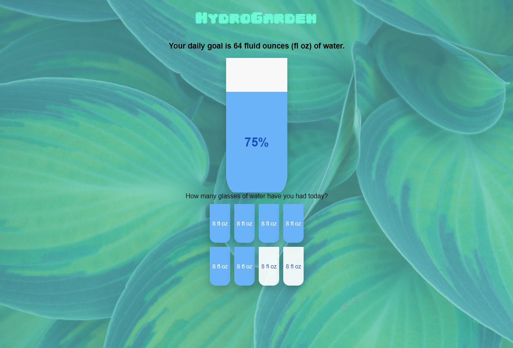

  <h2 align="center">🚰 HydroGarden</h2>

<a href="https://stephnicoledev.github.io/hydro-garden/"><a/>
    
HydroGarden is a water-tracking application that ensures you stay hydrated daily!

<a href="https://stephnicoledev.github.io/hydro-garden/"><strong>Live Site</strong></a>

## How It's Made:

**Tech used:** HTML, CSS, JavaScript

## What I learned:
<ul>
  <li>How to set up event listeners for when a user clicks on an element.</li>
  <li>How to add and remove classes on an element using <em>classList</em>.</li>
  <li>How to hide elements and make them visible using JavaScript.</li>
</ul>

## 🏗️ Features to add:
<ul>
  <li>Ability for users to add a custom water-intake goal.</li>
  <li>A congratulations message that pops up when the user reaches their goal.</li>
</ul>

